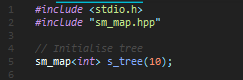
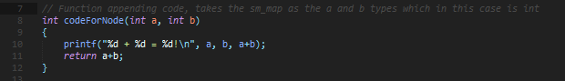
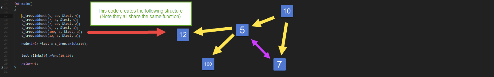
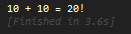

# Mapped-State-Machine

This C++ data structure is designed to ease the design and implementation of AI state based systems.

It features a nodal based map system with weighted one way links to other states.

These links are initiated based on function weight as well as an attached internal function that allowed for a return value for in depth processing.

## Example usage:

### Initialisation for a map of integer based data:

### Function initialisation

### Node addition and example function running

# TODO:

- Include overload operator templates for mulitple data types (namely overload for ==, vector sorting and print fucntions)
- Implement Dijkstra to optimize search path to other states
- Optimize addition recursion algorithm
- Add vector sorting algorithm for nodes (overload of existing vector addition) in order to sort linked nodes by weight
- Fix print function to not loop back on visited nodes
